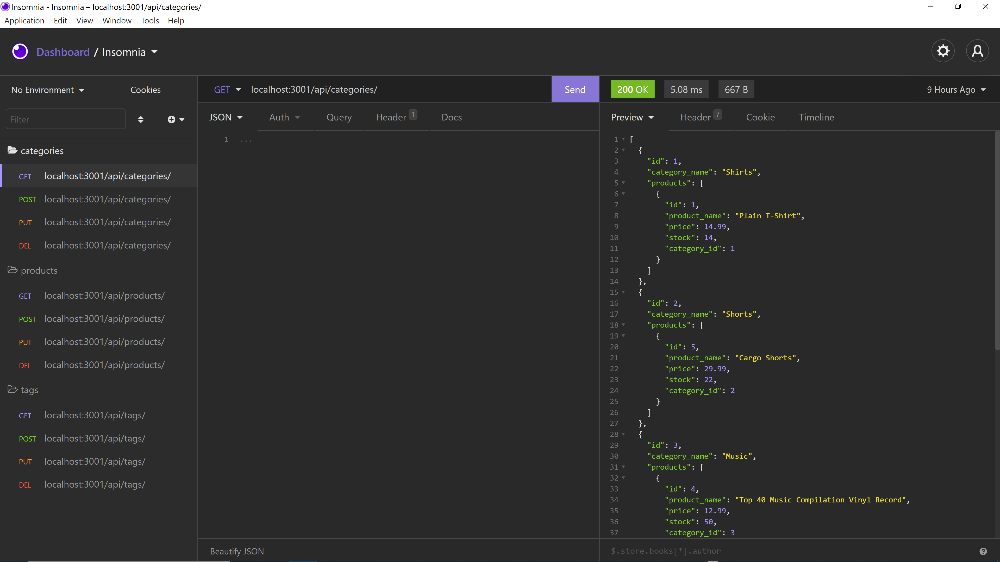
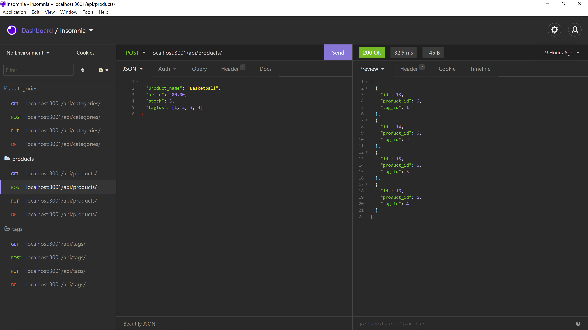
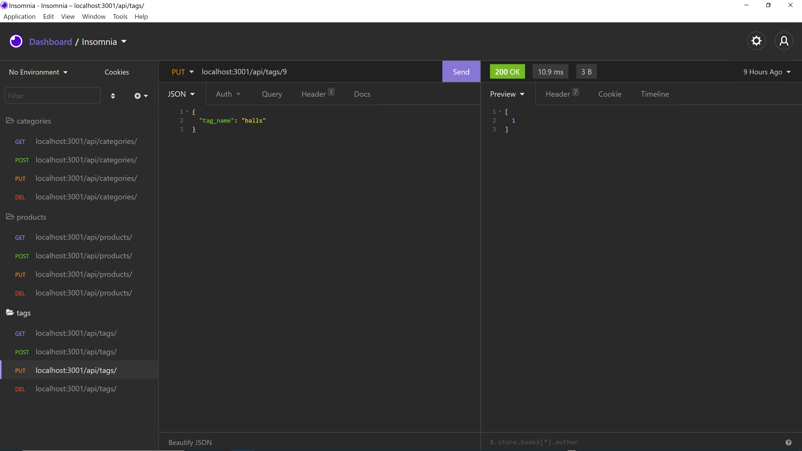

# e-commerce-database


## Description

For challenge 13 of the UM Coding Bootcamp, I had to use Node.js, Express.js, Inquirer, Sequelize, and MySQL to create an e-commerce backend database to the structure of Object Relational Mapping (ORM).


## Table of Contents

* [Mock-Up](#mock-up)

* [Built-With](#built-with)

* [Installation](#installation)

* [Usage](#usage)

* [License](#license)

* [Contributing](#contributing)

* [Questions](#questions)

* [Walkthrough Video](#walkthrough-video)

* [Repository](#repository)


## Mock-Up






## Built-With

Node.js, Express.js(framework), Inquirer(dependecy), Sequelize(dependency), and MySQL


## Installation

To install necessary dependencies, run the following command:
```md
npm i
```

## Usage

To use this application, run the following commands:
```md
mysql -u root -p
---->source db/schema.sql
npm run seed
npm start
```

## License

This project is licensed under the GNU GPLv3 license.


## Contributing

Please contact the owner of the repository if you would like to contribute.


## Questions

If you have any questions about the repo, open an issue or contact me directly at salasd10418@gmail.com. You can find more of my work at [Github](https://github.com/salasd93).


## Walkthrough Video

https://drive.google.com/file/d/1hvl7BIk9uCfjWSrz7PRQdX5lQ585Ub0H/view


## Repository

https://github.com/SalasD93/e-commerce-database